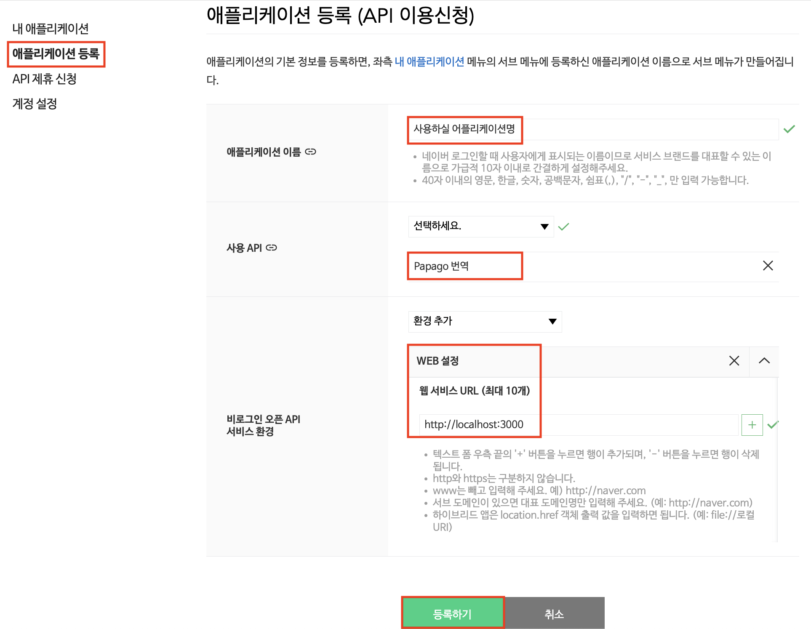

# 파파고 번역기

파파고 번역기 API를 사용해 한글->영어 번역해줍니다.
[네이버 개발자 센터](https://developers.naver.com/apps/#/list)에서 어플리케이션 등록 후,
Client Id/Secret 발급하시고 사용하시면 됩니다.

## 어플리케이션 등록 방법

## 네이버 Client Id/Secret 등록/변경

아래의 두 명령어를 사용해서 등록/변경

- Papago: 네이버 Client Id 등록/변경
- Papago: 네이버 Client Secret 등록/변경

## 사용가능한 명령어

- Papago: 번역(translate) ko->en (번역이 완료된 문구가 클립보드에 복사됩니다. ctrl(cmd)+v 로 사용하세요.)
- Papago: 네이버 Client Id 등록/변경
- Papago: 네이버 Client Secret 등록/변경
- Papago: 네이버 Client Id 조회
- Papago: 네이버 Client Secret 조회
